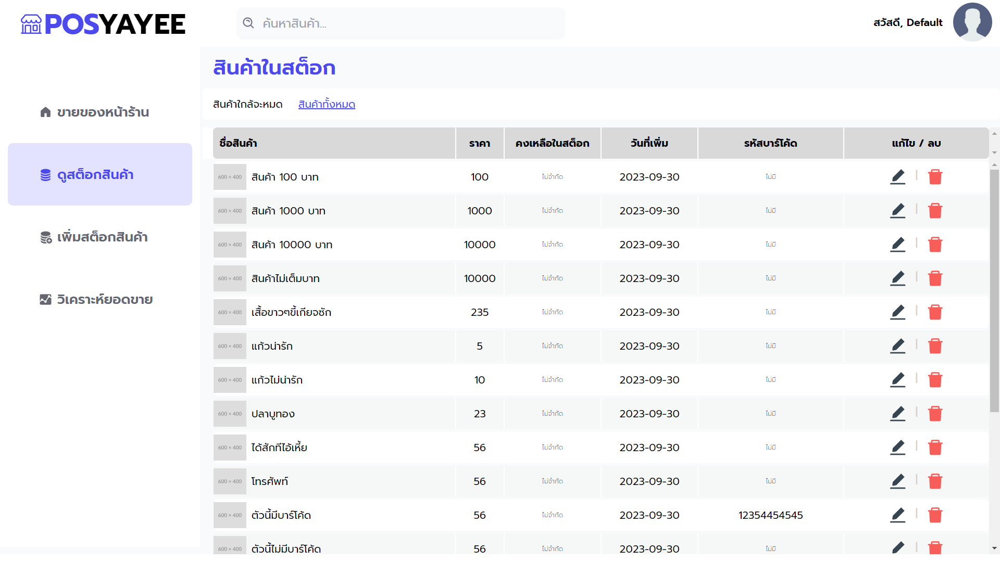

** First commit **
- สร้างหน้าหลัก Route ของ Aside (Left nav bar)
- เชื่อม API สินค้าไม่มีบาร์โค้ดมาแสดงหน้าหลัก 

** Second commit **
- ทำหน้าสต็อก 
- เพิ่มปุ่มค้นหา
- เชื่อม API สินค้าที่ใกล้จะหมด พร้อมทำ UI 
- เชื่อม API สินค้าที่ทั้งหมด พร้อมทำ UI 
- เพิ่มปุ่มลบและแก้ไขที่ยังกดไม่ได้ 
- ทำหน้าโหลดดิ้ง
- แก้ไขปุ่มตรง aside ที่ต้องดับเบิ้ลคลิ๊กถึงจะ active
  

** Third commit **
- ทำหน้า scan
- ทำฟังก์ชันลบข้อมูลจาก scan
- เพิ่มปุ่มแจ้งเตือนเวลาลบข้อมูลด้วย toatify
- เพิ่มปุ่มยกเลิกการขาย (ยังไม่ได้สร้าง pop-up confiirm)

** Fourth **

