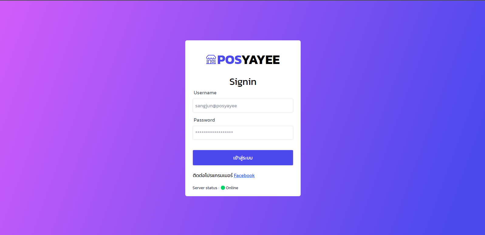
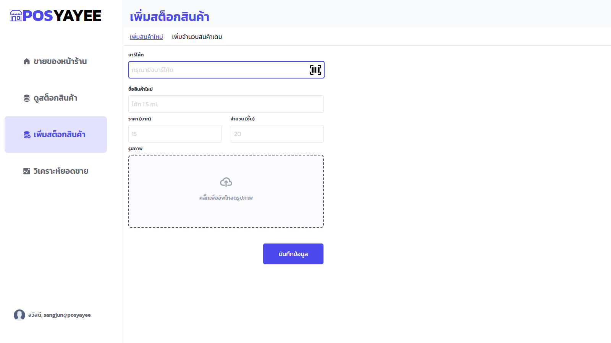
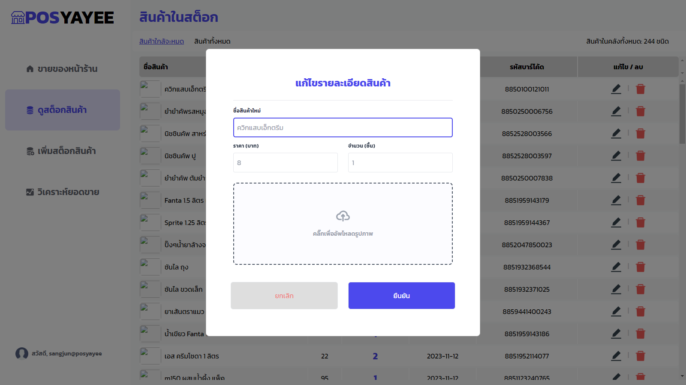
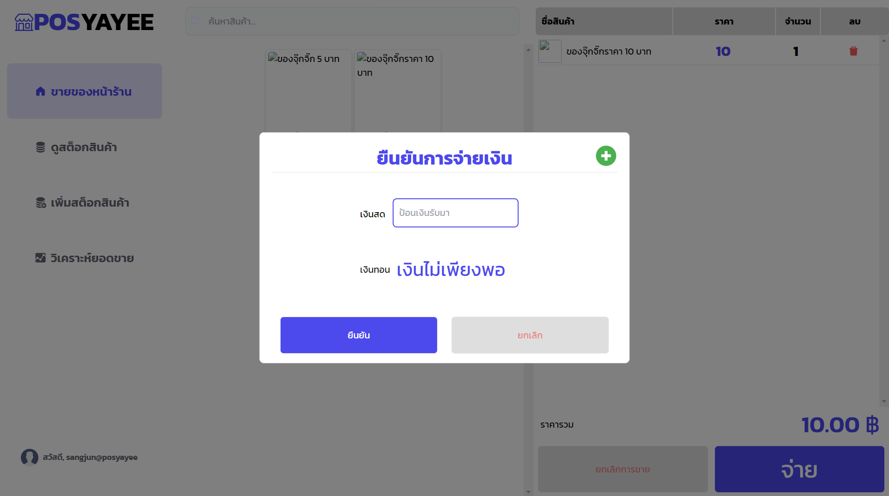
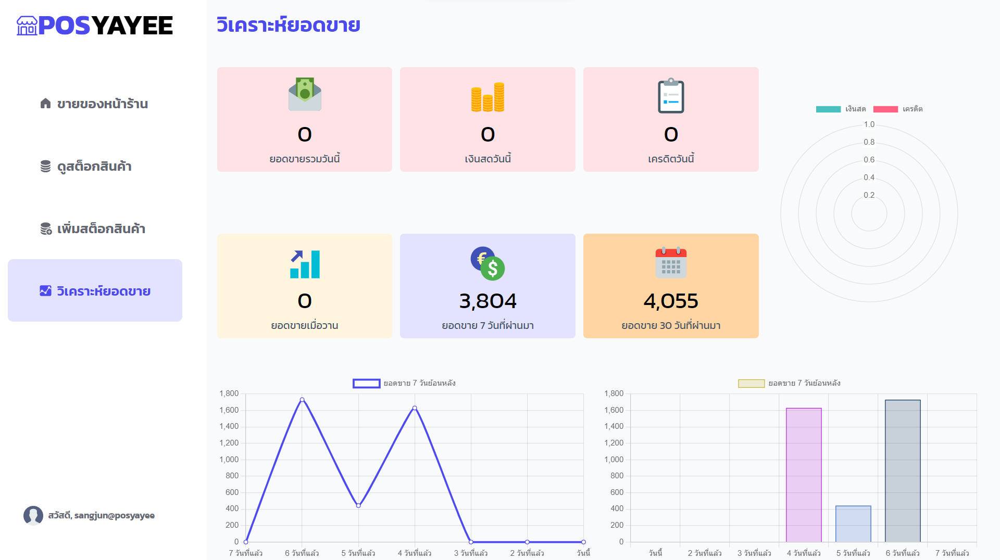

# อัพเดต 1.0.1
- UX/UI
  - เนื่องจากหน้า Sale.jsx ผู้ใช้สามารถที่จะครอปตัวหนังสือโดยไม่ได้ตั้งใจซึ่งทำให้สินค้าที่ไม่ได้ตั้งใจจะขายติดตะกร้าหรือเพิ่มจำนวนไปด้วย จึงมีการปรับปรุงในส่วนของ css เพื่อไม่ให้ผู้ใช้สามารถทำการดังกล่าวได้

#### ไฟล์ที่มีการแก้ไขได้แก่ 
- src\components\MainComponents\SaleProductCom\Sale.jsx

# อัพเดต 1.0.2
- BUG
   - แก้ไขบัคตอนที่กดยกเลิกการจ่ายเงินแล้วระบบยังส่งว่าจ่าย (หน้าป้อนเงินสดและระบบจะแสดงเงินทอน src\components\PopupComponents\ConfirmPayOrder.jsx) 

#### ไฟล์ที่มีการแก้ไขได้แก่ 
- src\components\PopupComponents\ConfirmPayOrder.jsx

# อัพเดต 1.0.3
- UX/UI
   - แก้ไข placeholder หน้า EditProduct.jsx ให้เป็นข้อมูลของสินค้าที่จะแก้ไข
   - ทำการเพิ่ม checkbox การใช้รูปภาพเดิมจะได้สะดวกต่อการแก้ไขสินค้า

#### ไฟล์ที่มีการแก้ไขได้แก่ 
- src\components\PopupComponents\EditProduct.jsx

# อัพเดต 1.0.4
- UX/UI
  - เนื่องจากย้าย server มาบน PM2 ซึ่งตอนนี้ยังมีปัญหาอยู่เลยทำ UI เพื่อเช็ค status ของ server ว่าออนไลน์อยู่ไหม

#### ไฟล์ที่มีการแก้ไขได้แก่ 
- src\components\Login.jsx

# อัพเดต 1.1.0
  - Functional problem
    - มีปัญหาเรื่องการเก็บรูปในรูปแบบลิงก์ทำให้ดึงข้อมูลช้าจึงมีการปรับทาง server เป็นการเก็บรปไว้ใน server และเก็บ path ที่ databse และปรับ UI จากการวางลิงก์เป็นการอัพโหลดรุปแทน
    - ลบฟังก์ชันเอารูปเดิมมาใช้เนื่องจากเป็นปัญหาเมื่อเก็บรูปบน server
  - Improve UX
    - มีการนำเสียงกดมาใช้เมื่อกดขายของที่ไม่มีบาร์โค้ดหน้าร้าน เนื่องจากอาจเผลอกดโดนโดยไม่รู้ตัวและอาจคิดราคาผิดจึงมีการนำเสียงมาใส่เพื่อจะได้หมดปัญหานี้ 
#### ไฟล์ที่มีการแก้ไขได้แก่ 
  - ทุกไฟล์ที่มีการแสดงรูป (แก้นิดหน่อย คือเปลี่ยนจากการดึง src ของรูปเป็นดึงจาก api ในไฟล์ uploads/[ ชื่อไฟล์ ])
  - ไฟล์หลักที่มีการแก้ไข  UI คือไฟล์ที่มีการอัพโหลดรูป
    - src\components\MainComponents\AddProductCom\AddNewProduct.jsx
      
    - src\components\PopupComponents\EditProduct.jsx
      
# อัพเดต 1.2.0
  - UX/UI 
    - แก้บัคในหน้าเพิ่มสินค้าเดิม(AddExistingProduct.jsx)เมื่อกดเพิ่มสินค้าแล้วให้รีเซ็ตค่าสินค้าที่แสกนมาให้หาย 
  - Funtional update4
    - เนื่องจากตอนขายมีการขายผ่านเงินเชื่อ(เครดิต)ทำให้ไม่สามารถระบุจำนวนเงินสดที่ถืออยู่ได้ จึงมีการเพิ่มฟังก์ชันขายเงินเชื่อเข้าไป
    - นอกจากนั้นยังต้องแสดงจำนวนสัดส่วนเงินเชื่อและเงินสดที่ Analysis
#### ไฟล์ที่มีการแก้ไขได้แก่  
  - src\components\MainComponents\AddProductCom\AddExistingProduct.jsx (UX/UI)
  - src\components\MainComponents\SaleProductCom\Scan.jsx  (เพิ่มฟังก์ชันจ่ายด้วยเครดิต)
  - src\components\PopupComponents\ConfirmPayOrder.jsx (เพิ่มปุ่มบวกสีเขียวเพื่อจ่ายด้วยเครดิต)
  - src\components\MainComponents\AnalysisCom\Analysis.jsx (เพิ่มสัดส่วนของเครดิตกับเงินสดและเพิ่มแสดงจำนวนเงินเครดิต)

  - รูปภาพ
  - 
  - 